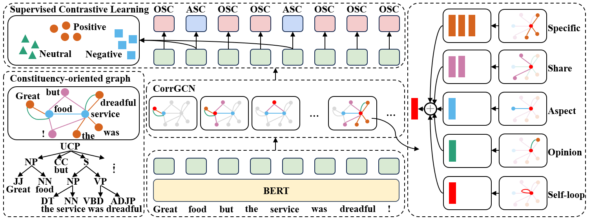
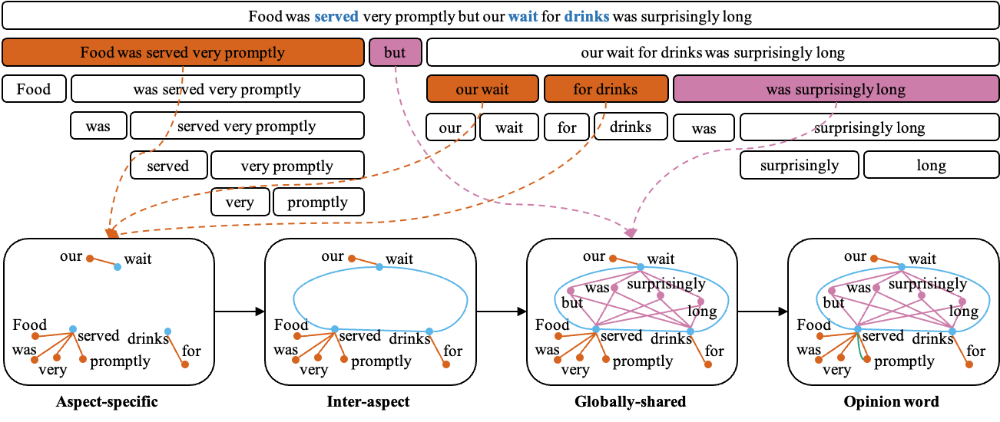

# **YORO**
Code for Paper "You Only Read Once: Constituency-Oriented Relational Graph Convolutional Network for Multi-Aspect Multi-Sentiment Classification"

*AAAI2024*

Yongqiang Zheng, Xia Li


## **Model**


## **Requirements**
- python==3.10.12
- torch==1.12.1+cu113
- transformers==4.30.2
- scikit-learn==1.2.2
- benepar==0.2.0

## **Datasets**
Download datasets from these links and put them in the **dataset** folder:
- [MAMS](https://github.com/siat-nlp/MAMS-for-ABSA)
- [Rest14](https://alt.qcri.org/semeval2014/task4)
- [Lap14](https://alt.qcri.org/semeval2014/task4)

## **Usage**
1. Download Bing Liu's opinion lexicon
```
wget http://www.cs.uic.edu/\~liub/FBS/opinion-lexicon-English.rar
sudo apt-get install unrar
unrar x opinion-lexicon-English.rar
mv opinion-lexicon-English lexicon
```
3. Generate constituency-oriented graph
```
python graph.py
```

An example of the construction of <u>C</u>onstituency-<u>Or</u>iented <u>R</u>elational <u>G</u>raph <u>C</u>onvolutional <u>N</u>etwork (CorrGCN)


## **Training**
```
bash train.sh
```

## **Credits**
The code in this repository is based on [SEGCN-ABSA](https://github.com/gdufsnlp/SEGCN-ABSA).

## **Citation**
```bibtex
@inproceedings{zheng2024you,
  title = {You Only Read Once: Constituency-Oriented Relational Graph Convolutional Network for Multi-Aspect Multi-Sentiment Classification},
  author = {Zheng, Yongqiang and Li, Xia},
  booktitle = {Proceedings of the AAAI Conference on Artificial Intelligence},
  volume = {38},
  number = {17},
  pages = {19715--19723},
  year = {2024},
  url = {https://ojs.aaai.org/index.php/AAAI/article/view/29945},
  doi = {10.1609/aaai.v38i17.29945},
}
```
